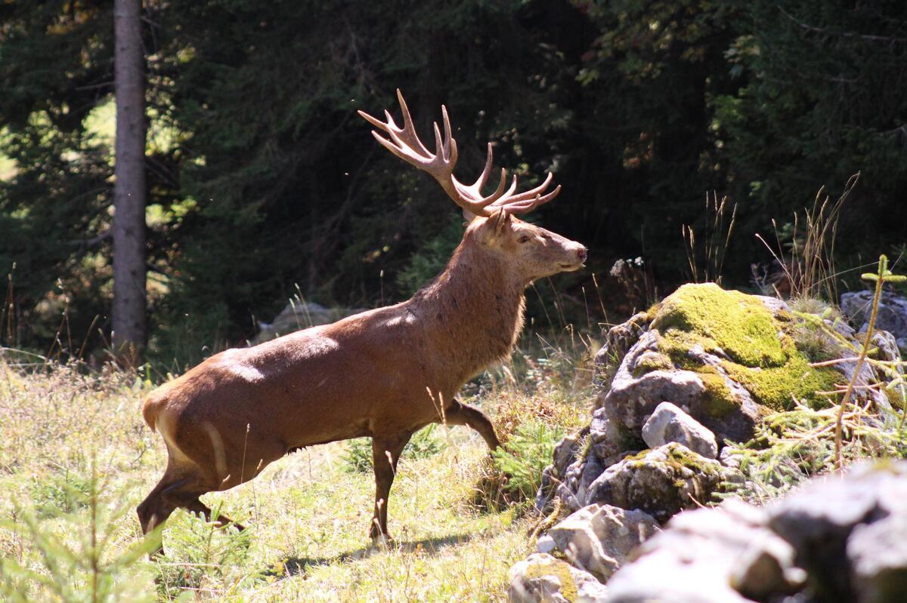
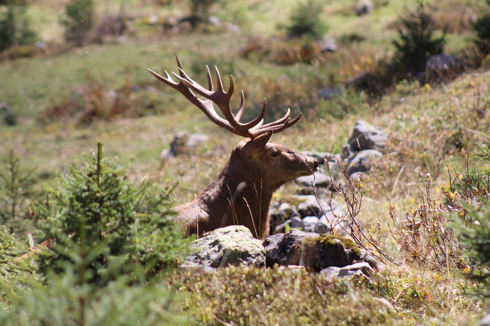

+++
title = "Hirsche aus dem Justistal "
date = "2023-05-02"
draft = false
pinned = false
tags = ["Hirsch"]
image = "medn1384-kopie.jpg"
description = "Das Justistal in der Schweiz ist bekannt für seine Population von Rothirschen (Cervus elaphus), die in der Region heimisch sind. Diese Hirsche sind eine der größten Hirscharten Europas und sind bekannt für ihr majestätisches Aussehen mit einem Geweih, das bei männlichen Tieren bis zu 1,5 Meter breit werden kann. Sie sind auch in anderen Teilen Europas und Nordamerikas verbreitet und sind ein wichtiger Bestandteil der Tierwelt in der Schweiz. In der Region Justistal können Besucher oft Hirsche beobachten, entweder in freier Wildbahn oder auf speziell ausgewiesenen Wildbeobachtungspfaden."
+++

